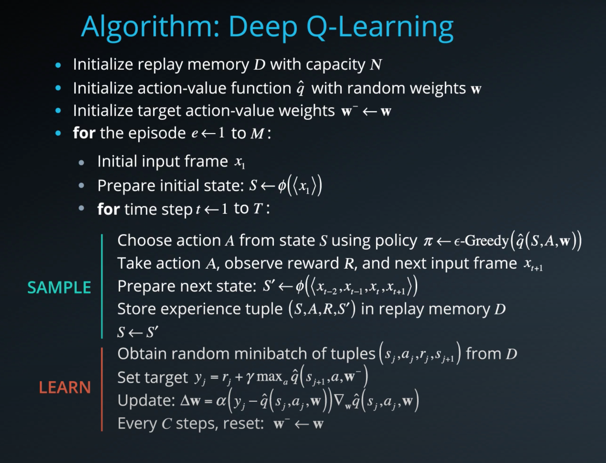

## Introduction
[Q-learning](https://en.wikipedia.org/wiki/Q-learning) is a model-free reinforcement learning algorithm to learn a policy telling an agent what action to take under what circumstances. It does not require a model (hence the connotation "model-free") of the environment, and it can handle problems with stochastic transitions and rewards, without requiring adaptations. Deep Q-learning or [DQN](https://web.stanford.edu/class/psych209/Readings/MnihEtAlHassibis15NatureControlDeepRL.pdf) is an extention of Q-learning, where instead of tabular representation of the optimal action-value function q*, a function approximation in the form of a neural network is used. This enables us to apply the algorithm to larger problem spaces including continuous state-space cases.

Reinforcement Learning can be unstable when the action-value is represented as neural network. DQN fix that using the following two improvements:

  1. **Experience Replay:** When the agent interacts with the environment, the sequence of experience tuples can be highly correlated. However, training of neural network or any supervised learning algorithm doesn't perform well under correlated samples. In DQN, an buffer is used to collect expeience tuples (state, action, reward, next_state) when agent interact with environment. Then random samples from this buffer is used to train the model and therefore reduce correlation of sequence of tuples.
  2. **Fixed Q-targets:** When minimizing TD-error, using the same weights on TD target and current value of the Q-function, i.e. both side of the mse error in the objective function, will results in instability. To address this issue, DQN uses two NN. A local and target NN. An iterative update rule is used to periodically update the target network, while we learn the local network.

## DQN Implementation
The DQN implementation is reproduced below (this is the same algorithm from the paper, I am using the version from the slides in Udacity lecture, which is nicely color coded for ease of reading).

My implementaion pretty much follows the algorithm shown above and is adopted and modified from the udacity example implementaton [here](https://github.com/udacity/deep-reinforcement-learning/blob/master/dqn/solution/dqn_agent.py). 

## Model Hyperparameters
- input = state_size
- network = 64 x 64
- output = action_size
- Adam optimizer with learning rate 5e-4
- relu activation in the intermediate layers
- #epoch = 1
- batch size = 64
- experience replay buffer size 1e5
- discount factor gamma = 0.99
- A soft update of target network was performed with tau = 1e-3
- Unlike the paper, instead of training every timestep, I updated the model every 4 timesteps

